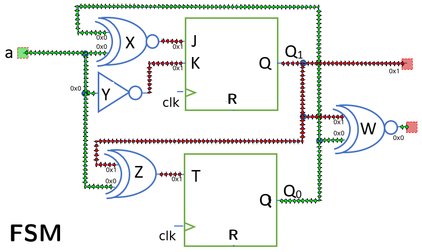

>dCir is an application designed for educational purposes. Its objective is to deepen the basic understanding of digital systems.
It is a hardware-focused simulator that visualizes how information flows through the circuit at the user's pace, allowing its evolution to be frozen at any point.

>**Project creation. **
To simulate a circuit, a project is required. The application provides the means to do this. Everything revolves around
a drawing containing the elements of the digital circuit. This drawing can be generated with any graphics application;
the .png and .jpg formats are accepted. The important elements of the drawing are the constituent blocks (gates, flip-flops, etc.)
and their interconnections; any other element is considered purely aesthetic. The entire project is based on plain text files.

>The next step in generating the project is to transfer the content of the drawing to the application.

>**Simulation. **
After loading the project, it can be simulated. Operating conditions are set (input values, flip-flop initialization, etc.)
and the circuit's progress is displayed. All flip-flops operate with the same clock and are controlled manually.

>**Configuration. **
Different operating parameters related to information display can be configured, such as
the speed of information propagation through the circuit, colors, labels, etc.

>**Exemples. ** 
A series of examples are attached to help you get started quickly with the simulation. One of them is the "simple machine".
This is a small microcomputer system with all its supporting elements: memory management, assembler, peripherals, etc.

>[examples](./Examples.zip).

## Installation

> devtools::install_github("EdelCastillo/dCir")

> Please note that is a development version and no release has been made yet. So, keep looking at this page for future updates and releases.

>[user manual](./dCir_tutorial.pdf).

